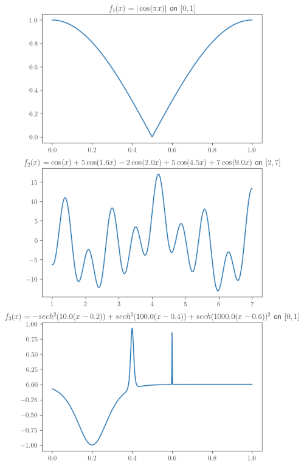

# FSU_ISC4221C_Fall23_Lab3
Random processes
## Objective
We want to see how we can use Monte Carlo to solve
a difficult problem in scientific computing, locating the global extrema of a function. We
will only consider functions of one independent variable.

**All your answers should be in a single file named `answers_lab.py`; be careful with the names of your functions. Your report should be a self-contained markdown file with a description of your answers and the code copied inside of it.**

### 1D Optimization Problem

We consider the 1D optimization problem of finding a point $x^*$ in a given domain $D \subset \mathbb{R}^1$ where the function $f(x)$ attains its global minimum. If we can solve this problem, then we can also find its global maximum by finding the global minimum of $-f(x)$.

The difficulty with optimization is that the function may have several local minima. Most minimization algorithms can be "trapped" by a local minimum. We are going to see how we can develop an algorithm that uses Monte Carlo sampling to estimate the location of the global minimum.

### Why Randomize?

It would be fair to ask why we bother randomizing this algorithm. Why not just divide up the region into, say 500 equally spaced points; then you will guarantee that you sample all the space just as well (even better, because you know there can't be any large gaps). There are several reasons to use pseudorandom sequences to sample the domain. One of the reasons is that in two or three dimensions we may have a very complicated geometry. Another reason is that when we go to higher dimensions, i.e., a function of several variables, then our 500 points in one dimension become $500^d$ in $d$ dimensions. It should be noted that there are much better sampling methods than Monte Carlo and those should be used in practice.

## Algorithm Description

Assume that we want to find the global minimum of $f(x)$ on $[a, b]$. We want to do this in as few function evaluations (i.e., evaluation of $f$ at a point) as possible. Our first strategy will be to sample $[a, b]$ with $n$ points $\{x_{i}\}_{i=1}^{n}$ using Monte Carlo and evaluate the function at each of those points. As we sample each point, we keep track of which $x$ value has the smallest function value. From all the sampling points, we choose the location where $f(x)$ takes on its minimum value and that will be our answer. This algorithm will converge as $n \to \infty$. We will consider modifications to this algorithm in the exercises.

## Test Functions

We consider three functions, each more difficult than the previous to locate its minimum.

* $f_1(x) = | \cos( \pi x) |\text{ on } [0,1]$

* $f_2(x) = \cos(x) + 5  \cos(1.6  x) - 2  \cos(2.0  x) + 5  \cos(4.5  x) + 7  \cos(9.0  x) \text{ on } [2, 7]$

* $f_3(x) = - \text{sech}^2(10.0  (x - 0.2)) + \text{sech}^2(100.0  (x - 0.4)) + \text{sech}(1000.0  (x - 0.6))^2 \text{ on } [0, 1]$


To compare codes, please use a seed of 56789 for easier grading.

## Exercises

### 1. Plotting (10 pts)

1. Plot the three functions $f_i(x)$, $i = 1, 3$ on their domains. Save them and include them in your folder. From the graphs, estimate the location of the global minimum and all local minimums of the functions.

Similar to the following figure (Text estimation of global and local minimum is fine)):




### 2. Implement Sampling Algorithm (40 pts)

Write a code to implement our sampling algorithm for locating a global minimum of a function. Your code should have the following structure:

- **name**: `find_min_mc`
- **Input**: $n$ the number of sampling points;
- **xl, xr** the endpoints of the interval where the function is defined (so you can map the random point to that interval)
- **f** the function to be minimized
- **Output**: the location and value of the minimum that the algorithm found.

```Python
def find_min_mc(n, xl, xr, f):
    # Your code here
    return [xmin, ymin]
```

You can make sure your code is working properly by finding the local minimum of our "easy" function 
$f_1(x)$. For $f_1(x)$ we know the exact location of its global minimum. 

(10/40 Pts) Make a table of $n$ and the error in the location of the minimum as $n$ increases. For example, $n = 25, 50, 100, 200, 400, 800, 1600$.

### 3. Advanced Sampling Strategy (40 pts)

If we have a good approximation to the location of the global minimum, it probably doesn't make sense to keep sampling in the entire domain; you saw in **#2** that sometimes doubling the number of points didn't improve the accuracy. A better strategy might be that once we have an approximation then we only sample around that approximation to zoom in on a more accurate approximation to the location of the minimum. Of course, if we have too few random points in our initial sweep and have an erroneous location, then zooming in is not going to help us; that is why this approach is not guaranteed to converge unlike the brute force approach in **#2**.

After we have located our approximation, say $x_1$ to the local minimum by generating $n$ random points, then we will sample in the interval $[x_1 - \delta, x_1 + \delta]$ using say $m = \frac{n}{2}$ points (of course you can change this) to get points $\{ x_1{i} \}^m_{i=1}$ and we can determine our second approximation to the global minimum $x_2$ by evaluating $f(x)$ at each of these random points. The procedure can be repeated. At the last step, we choose the location where $f(x)$ takes on its smallest value; this is our approximation to $x^*$.

Remember that the algorithm is not guaranteed to converge to a global minimum but if our initial sampling is good enough, we should be able to capture the minimum for most functions.

(30/40 pts) Make an additional function `find_min_mc_wzoom` that includes the input `nzoom`, the number of zooms we will use; if `nzoom=0` you should have the algorithm from **#2**. 

(10/40 pts) We want to run the code for $f_2$, $f_3$ and **compare** the **number of function evaluations** required as a function of `nzoom` to find the global minimum and its location to a **desired accuracy**. You should choose the calculations which best support your conclusion.

```Python
def find_min_mc_wzoom(n, xl, xr, f, nzoom):
    # Your code here
    return [xmin, ymin]
```
